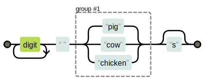
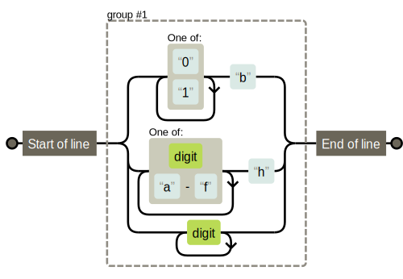

# Regular Expressions

> Some people, when confronted with a problem, think ‘I know, I’ll use regular expressions.’ Now they have two problems.
> 
> ---- Jamie Zawinski

<p align="center">
    
</p>


## Creating a regular expression

``` typescript
let re1 = new RegExp("abc");
let re2 = /abc/;
```
*When using the `RegExp` constructor, the pattern is written as a normal string, so the usual rules apply for backslashes.*


## Sets of characters
putting a set of characters between square brackets makes that part of the expression match any of the characters between the brackets

``` typescript
/[0123456789]/
```

Within square brackets, a hyphen (-) between two characters can be used to indicate a range of characters, where the ordering is determined by the character’s Unicode number

``` typescript
/[0-9]/
```

Built-in shortcut of some common character groups:

* `\d`  : Any digit character
* `\w`  : An alphanumeric character (“word character”)
* `\s`  : Any whitespace character (space, tab, newline, and similar)
* `\D`  : A character that is not a digit
* `\W`  : A nonalphanumeric character
* `\S`  : A nonwhitespace character
* `.`   : Any character except for newline

You could match a date and time format like 01-30-2003 15:20 with the following expression:

``` typescript
let dateTime = /\d\d-\d\d-\d\d\d\d \d\d:\d\d/;
```

> To indicate that a pattern should occur a precise number of times, use braces.
> * Putting {4} after an element, for example, requires it to occur exactly four times.
> * It is also possible to specify a range this way: {2,4} means the element must occur at least twice and at most four times.
> * You can also specify open-ended ranges when using braces by omitting the number after the comma. For example, {5,} means five or more times.

``` typescript
let dateTime = /\d{1,2}-\d{1,2}-\d{4} \d{1,2}:\d{2}/;
```

To invert a set of characters—that is, to express that you want to match any character except the ones in the set—you can write a caret (`^`) character after the opening bracket.

``` typescript
let nonBinary = /[^01]/;
```


## Repeating parts of a pattern
* Put a plus sign (`+`) after something in a regular expression: element may be repeated more than once.
* Put a star(`*`) after something in a regular expression: similar meaning to plus sign but also allows the pattern to match zero times.
* A question mark (`?`) makes a part of a pattern optional.


## Grouping subexpressions
To use an operator like `*` or `+` on more than one element at a time, you must use parentheses. 

## Boundaries and look-ahead
If we want to enforce that the match must span the whole string, we can add the markers `^` and `$`. The caret matches the start of the input string, whereas the dollar sign matches the end. 

## Choice patterns
The pipe character (`|`) denotes a choice between the pattern to its left and the pattern to its right.

``` typescript
let animalCount = /\d+ (pig|cow|chicken)s?/;
```

## The mechanics of matching

<p align="center">
    
</p>

### Backtracking

`/^([01]+b|[\da-f]+h|\d+)$/`
<p align="center">
    
</p>

> The matcher stops as soon as it finds a full match. This means that if multiple branches could potentially match a string, only the first one (ordered by where the branches appear in the regular expression) is used.

Backtracking also happens for repetition operators like + and *.

`/^.*x/`
<p align="center">
    
</p>


## References 

https://eloquentjavascript.net/09_regexp.html

https://regexper.com/